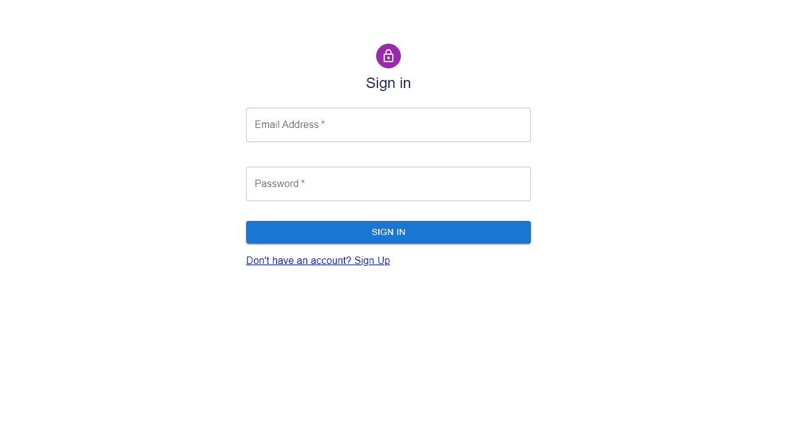
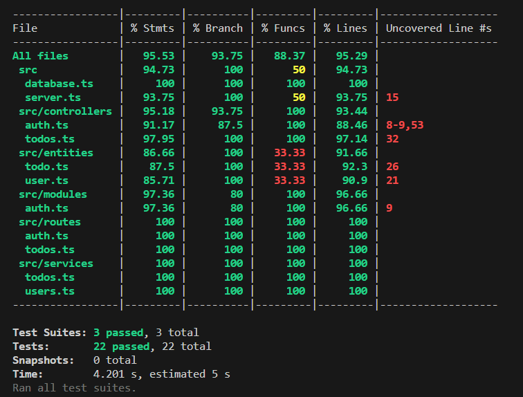

# To Do app

My goals with this technical challenge were to recap the best practices for full stack development and to deliver a working product.



User stories:

* As a user I want to create an account so that I can keep my data secure - done
* As a user I want to login so that I can access my agenda - done
* As a user I want to create an item on my to do so that I can organize my work - done
* As a user I want to visualize my to do list so that I’m aware of the priorities - done
* As a user I want to mark an item as complete so that I can feel the progress of getting things done - done
* As a user I want to visualize my complete tasks so that I can review them - done
* As a user I want to edit a to do item so that I can refine it better - not done
* As a user I want to delete a to do item so that I can declutter my agenda - done

## Approach and tech stack

The first step I took was to analyze the requirements and confirm my understanding by writing a backlog of user stories that would describe the basic functionalities in terms of user needs. This was also a good opportunity to ask questions to refine the backlog and confirm tech preferences.

The second step was create a high level design and to decide on the technology choices that would enable me to reach the goals. In the high level design I’ve defined backend endpoints and request/response samples to describe the interaction between the two components, mock data and create the database schema.

### Frontend stack

On the frontend I’ve used React with JavaScript and Material UI to ensure a consistent user experience. To enable client side routing I’ve used React Router. This choices enabled me to practice with the basics of structuring a relatively small application from scratch, but also created some pitfalls of building the application framework that I will later explain.

The application is organized in pages and small components. For handling shared authentication data useContext hook was used and the token is persisted in local storage.

### Backend stack

O the backend I’ve used TypeScript with ExpressJS for exposing the API endpoints, TypeORM for interacting with the database, Jest and supertest for unit testing. For security features I’ve included bcrypt and jsonwebtoken.

The backend is structured by layers with specific concerns. The routers define the endpoints and delegate requests to handlers defined in controllers. The controllers are responsible for parsing request data and preparing the response. Services contain the logic of the application and call the models for data operations. The functions related with security were defined i a module to ensure separation of application logic.

### Testing

For testing I've ensured coverage of all endpoints with integration tests. All database operations were mocked to ensure good performance of the testing framework. For the security module more unit tests were added as I considered a part that required extra attention.



## Conclusions and improvements

Overall I've managed to accomplish both goals during this assignment. Setting up all the libraries from scratch gave me a better understanding of the entire stack, but it also surfaced impediments that gave me less time to focus on features. One impediment was around the use of context in react for authentication, that I haven't setup before from scratch. The second was around mocking the internals of TypeORM. 

An alternative approach would have been to rely on frameworks like NestJS and NextJS that already handle the structure of the project, the logic for authentication and provide a better testing framework. 

Given that I would allocate more time I would do the follwing improvements:

* Define and improve rules for better validation of data
* Create a schema for API endpoints
* Better state management on frontend. Currently the tasks are passed down to child componets with props.
* Use TypeScript on frontend
* On the backend reduce code duplication for handling errors in the controllers by adding middlewares
* Add more unit tests on backend and end-to-end testing on frontend

## App setup

1. Install dependecies on both frontend and backed

```
npm install
```

2. Configure .env file on backend (JWT and MySQL credentials)

```
PORT=3001
JWT_SECRET=
DB_HOST=
DB_USERNAME=
DB_PASSWORD=
DB_DATABASE=
```

3. Start in dev mode

Backend
```
npm run start:dev
```

Frontend
```
npm start
```

4. Build

```
npm run build
```